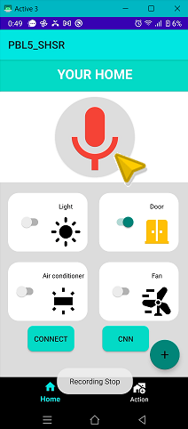
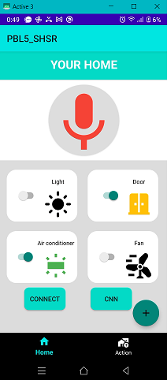
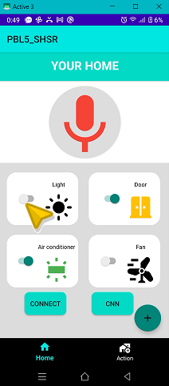
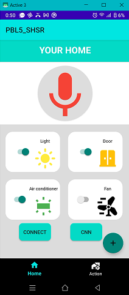
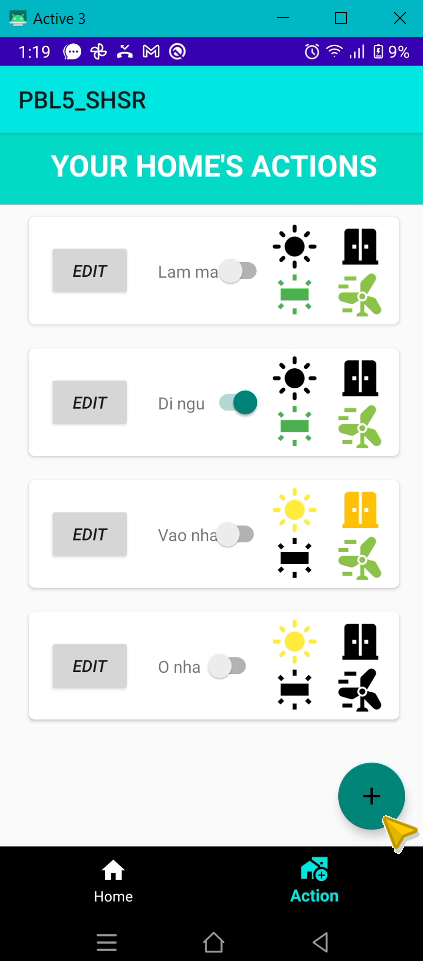
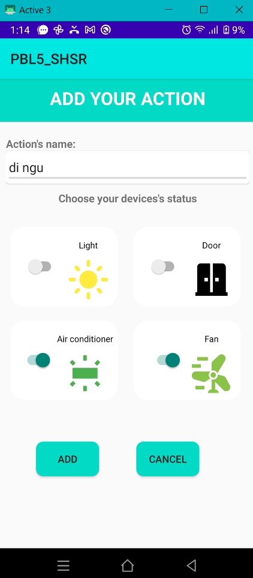
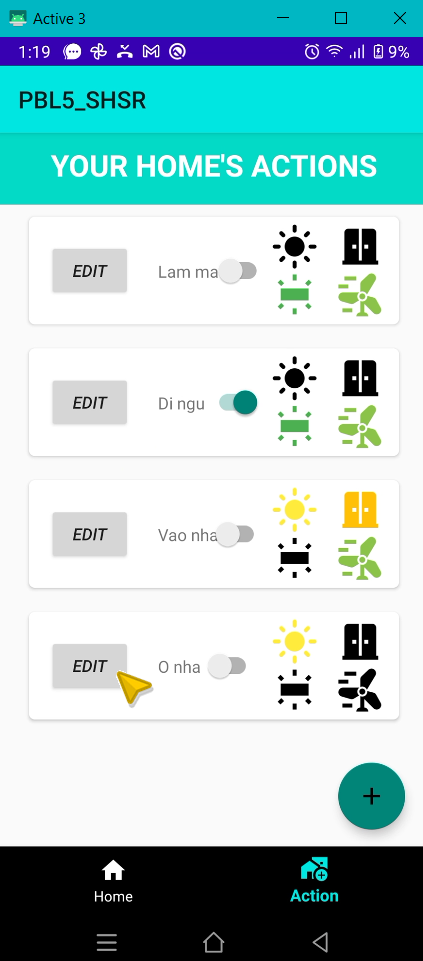
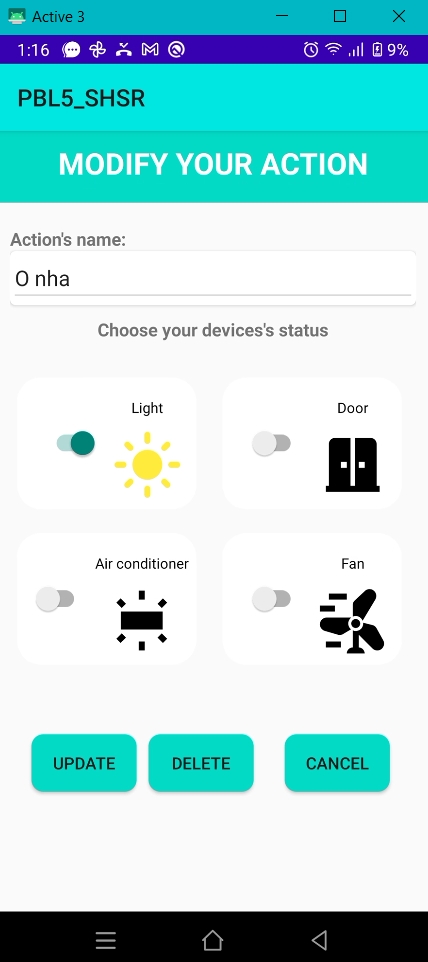

# Hướng dẫn cài đặt
- Cài đặt ứng dụng điện thoại tại folder TestNewAction vào máy điện thoại sử dụng hệ điều hành Android
- Cài đặt phần mềm điều khiển hệ thống nhà thông minh tại folder raspberry
- Sau khi đã thực hiện cài đặt ứng dụng và hệ thống điều khiển, các bạn mở ứng dụng lên.
1. Thực hiện ghi âm câu lệnh

|            ||            |

Chọn button có hình Micro lần thứ nhất, sẽ có thông báo "Start Recording" trên màn hình cho bạn biết ghi âm đang được thực hiện.

2. Thực hiện dừng âm câu lệnh

|            ||  

Chọn button có hình Micro lần thứ hai, sẽ có thông báo "Stop Recording" trên màn hình cho bạn biết ghi âm đã được ngưng lại. Đồng thời, kết thúc ghi âm, ứng dụng sẽ đẩy file ghi âm lên database để hệ thống nhận diện câu lệnh

3. Sau khi nhận diện câu lệnh

|            ||  

Như kết quả so với bước trên, bạn nhận thấy câu lệnh "Bật điều hòa" đã được nhận diện chính xác và trạng thái của thiết bị điều hòa đã sáng lên.

4. Điểu khiển thiết bị điện

|            ||  

|            ||  

Đồng thời bạn cũng có thể thay đổi trạng các thiết bị điện bằng cách chọn trực tiếp vào một thiết bị. Ta có thể thấy Đèn đã được bật sau khi chọn trực tiếp.

5. Sử dụng tính năng Actions

|            ||  

Ngoài ra bạn cũng có thể thay đổi trạng thái của một Action (tập hợp trạng thái các thiết bị) bằng cách bấm vào Switch button của Action tương ứng.

5.1 Thêm mới Action

|            || 

|            ||  

Bạn cũng có thể thêm Action mới bằng cách bấm vào dấu "+" ở trên giao diện ứng dụng. Nhập thông tin action và trạng thái các thiết bị mà bạn muốn, chọn ADD để thêm action và CANCEL để hủy.

5.1 Sửa/Xóa Action

|            ||

|            ||  

Bạn cũng có thể thay đổi thông tin hoặc xóa Action  bằng cách bấm vào nút Edit trên giao diện. Nhập thông tin action và trạng thái các thiết bị mà bạn muốn thay đổi, chọn UPDATE để thay action và CANCEL để hủy. Ngược lại chọn DELETE để xóa đi action đó.