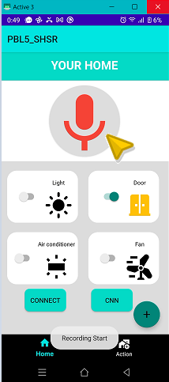

# Hướng dẫn cài đặt
- Cài đặt ứng dụng điện thoại tại folder TestNewAction vào máy điện thoại sử dụng hệ điều hành Android
- Cài đặt phần mềm điều khiển hệ thống nhà thông minh tại folder raspberry
- Sau khi đã thực hiện cài đặt ứng dụng và hệ thống điều khiển, các bạn mở ứng dụng lên.
1. Thực hiện ghi âm câu lệnh

